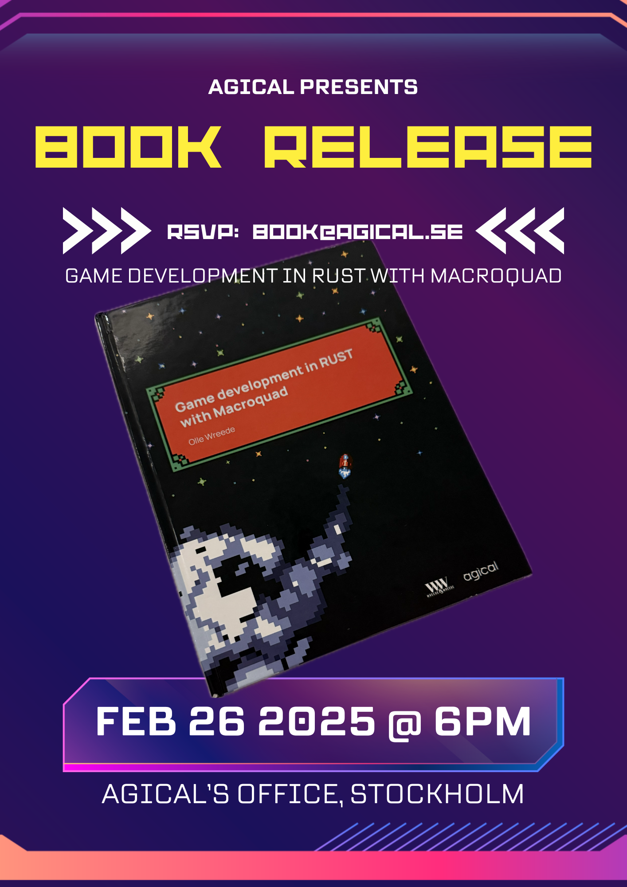

# Game development in Rust with Macroquad



On [February 26 at 6pm CET](https://events.agical.se/events/bokslapp-game-development-in-rust-with-macroquad-20250226/) there will be a book release party for the print version
of this guide at the Agical office in Gamla Stan, Stockholm, Sweden. RSVP to
[book@agical.se](mailto:book@agical.se) if you want to attend, and please
mention if you want to buy a copy of the book.

After the release party, the book will be available for purchase online.


This guide is written by Olle Wreede at [Agical](https://www.agical.se/).

Olle Wreede is a senior software developer working at Agical where he helps
customers build better software. He has worked in the software industry for
two and a half decades.

Agical helps their customers deliver software earlier. By focusing on helping
everyone involved, getting better at working together and improving their
technical skills.

<div class="onlyprint">
This guide is available online at the following address:  
https://mq.agical.se/
</div>

The source code for all chapters of this book is available here:  
[https://mq.agical.se/github.html](https://mq.agical.se/github.html)

<div class="page-break"></div>

## Game development guide

In this guide we will be developing a game from scratch. In each chapter we
will add a small feature to the game that explains a part of the Macroquad
library. In the beginning the game will be very simple, but at the end of the
guide you will have built a complete game with graphics and sound. You will be
able to build the game for desktop computers, the web, as well as mobile
devices.

The game we are making is a classic shoot 'em up where the player controls a
spaceship that has to shoot down enemies flying down from the top of the
screen.

<div class="noprint">
At the end of every chapter there is a short quiz that shows you how much
you've learned. The answers are anonymous and are not stored anywhere.
</div>

```admonish tip title="Challenge" class="challenge"
This is Ferris, the teacher who will show up at the end of every chapter
to give you an extra challenge. Doing the challenge is optional; you can
continue to the next chapter without it.
```

## The Macroquad game library

Macroquad is a game library for the programming language Rust. It includes
everything you need to develop a 2D game. The main advantage of Macroquad
compared with other game libraries is that it works with many different
platforms. Since it has very few dependencies it also compiles very fast.

With Macroquad it's possible to develop games for desktop operating systems
like Windows, Mac, and Linux. It also has support to compile for mobile
devices like iOS and Android. Thanks to the WebAssembly support it can also
be compiled to run in a web browser. All this can be done without having to
write any platform specific code.

The library has efficient 2D rendering support, and some rudimentary 3D
features. It also includes a simple immediate UI library to make graphical
game interfaces.

This guide assumes some prior knowledge of Rust programming. However there are
no advanced concepts, so if you already know another programming language it
is still possible to follow along. More information about Rust is available in
the [Rust book](https://doc.rust-lang.org/book/) that is available online. I
can also recommend the book [Hands-on Rust](https://hands-on-rust.com/) by
Herbert Wolverson where you learn Rust by writing a roguelike game.

```admonish info title="Find more info on the Macroquad homepage"
On the [Macroquad homepage](https://macroquad.rs) there are
[examples](https://macroquad.rs/examples/) of how different features
of Macroquad work, Macroquad-related [articles](https://macroquad.rs/articles),
and [documentation of the API](https://docs.rs/macroquad/latest/macroquad/).
```

```admonish note title="Macroquad version 0.4"
This guide is written for version 0.4 of Macroquad. It may not work for future
versions because Macroquad is under active development.
```

## PDF book

This guide is also available as a downloadable [PDF book](https://mq.agical.se/pdf/output.pdf).

<div class="noprint">
In the top right hand corner of the site there is a link to a
<a href="print.html">printable version</a> of the guide as well.
</div>

<p xmlns:cc="http://creativecommons.org/ns#" xmlns:dct="http://purl.org/dc/terms/"><a property="dct:title" rel="cc:attributionURL" href="https://mq.agical.se/">Game development in Rust with Macroquad</a> by <a rel="cc:attributionURL dct:creator" property="cc:attributionName" href="https://olle.wreede.se/">Olle Wreede</a> is licensed under <a href="https://creativecommons.org/licenses/by-sa/4.0/?ref=chooser-v1" target="_blank" rel="license noopener noreferrer" style="display:inline-block;">CC BY-SA 4.0</a></p>

