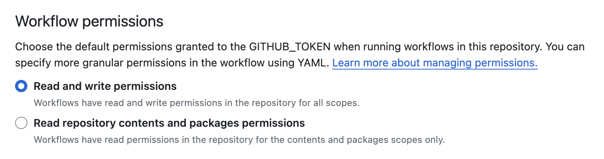
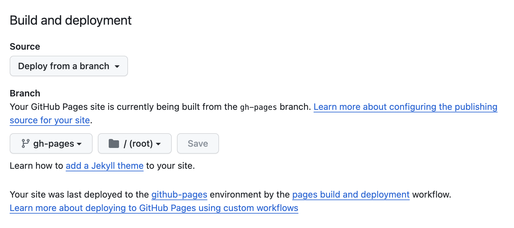

# Ditt första Macroquad-program

Nu är det dags att programmera ditt första program med Macroquad. Börja med
att installera programmeringsspråket Rust om du inte redan har gjort det.


## Implementering

Skapa ett nytt Rust-projekt med Cargo och lägg till `macroquad` med version
0.4 som beroende.

```sh
cargo new --bin mitt-spel
cd mitt-spel/
cargo add macroquad@0.4
```

Din `Cargo.toml` fil kommer nu se ut såhär:

```toml
[package]
name = "mitt-spel"
version = "0.1.0"
edition = "2021"

# See more keys and their definitions at https://doc.rust-lang.org/cargo/reference/manifest.html

[dependencies]
macroquad = "0.4"
```

Öppna filen `src/main.rs` i din favorit-editor och ändra innehållet till
följande kod:

```rust
{{#include ../../mitt-spel/examples/first-program.rs}}
```

Kör programmet med `cargo run` så ska ett nytt fönster med mörklila bakgrund
öppnas efter att kompileringen är klar.

## Beskrivning av programmet

Första raden används för att importera allt som behövs från Macroquad, vilket
enklast görs med `use macroquad::prelude::*`, men det går också att importera
alla funktioner manuellt.

Attributet `#[macroquad::main("Mitt spel")]` används för att berätta för
Macroquad vilken funktion som ska köras. Macroquad kommer skapa ett fönster
med titeln som anges som argument, och exekvera main-funktionen asynkront.

```admonish info
För att ändra andra inställningar för fönstret, som storlek eller om det ska
visas i fullskärm, går det att använda structen
[Conf](https://docs.rs/macroquad/latest/macroquad/window/struct.Conf.html).
```

Inne i main-funktionen körs en evig loop som aldrig avslutas. Inne i loopen
ligger all spellogik som ska köras varje bildruta. I vårt fall rensar vi
bakgrunden till mörklila med funktionen `clear_background(DARKPURPLE)`. I
slutet av loopen används funktionen `next_frame().await` som kommer blocka
exekveringen tills nästa bildruta.

```admonish note title="Notera" 
Även om `clear_background()` inte används explicit så kommer Macroquad att rensa
skärmen i början av varje bildruta.
```

```admonish tip title="Utmaning" class="challenge"
Prova att ändra vilken bakgrundsfärg fönstret ska ha till din favoritfärg.
```

## Quiz

Testa dina nya kunskaper genom att svara på följande quiz innan du går vidare.

{{#quiz ../quizzes/first-program.toml}}

## Publicera på webben (om du vill)

En stor fördel med Rust och Macroquad är att det är väldigt smidigt att kompilera ett fristående program för olika plattformar. Vi kommer att gå igenom hur det görs senare i den här guiden, men om du vill kan du redan nu ordna så att varje gång du pushar kod till ditt Github-repository så publiceras även en webbläsarversion av spelet.

När du skapade spelet med `cargo new` skapades även ett lokalt Git repository. Börja med att committa dina ändringar lokalt. Skapa sedan ett repository på Github, och pusha koden dit.

Du behöver ändra inställningarna för Github-repot så att workflows har skrivrättigheter. **Settings** -> **Actions** > **General** > **Workflow permissions**:



```admonish note
Nedanstående två filer refererar till `mitt-spel.wasm`. Om du döpt din crate till något annat än `mitt-spel` behöver du ändra de referenserna.
```

Det behövs en HTML-fil för att visa spelet. Skapa `index.html` i roten av projektet/craten med detta innehåll:

```html
{{#include game.html}}
```

Följande Github Actions Workflow kompilerar spelet till WASM och lägger i ordning alla filer så att spelet funkar på webben. Koden skall placeras i `.github/workflows/deploy.yml`.

```yaml
{{#include ../../mitt-spel/examples/deploy-early.yml}}
```

Committa och pusha! Första gången du gör det kommer spelet att byggas och alla filer placeras rätt i branchen `gh-pages`, men ingen webbsida kommer byggas. Du behöver justera en inställning till för Github-repot, **Settings** > **Pages** > **Build and deployment**:



Du kan följa bygget under **Actions** för repositoryt. När det är klart kommer du kunna “spela” spelet på `https://<ditt-github-namn>.github.io/<reposritory-namn>`.

Spela, och spela... du ska se en helt lila webbsida. Men vartefter du lägger till saker till spelet och pushar dem till Github kommer den senaste versionen kunna spelas på webben. Redan i nästa kapitel börjar det röra på sig!